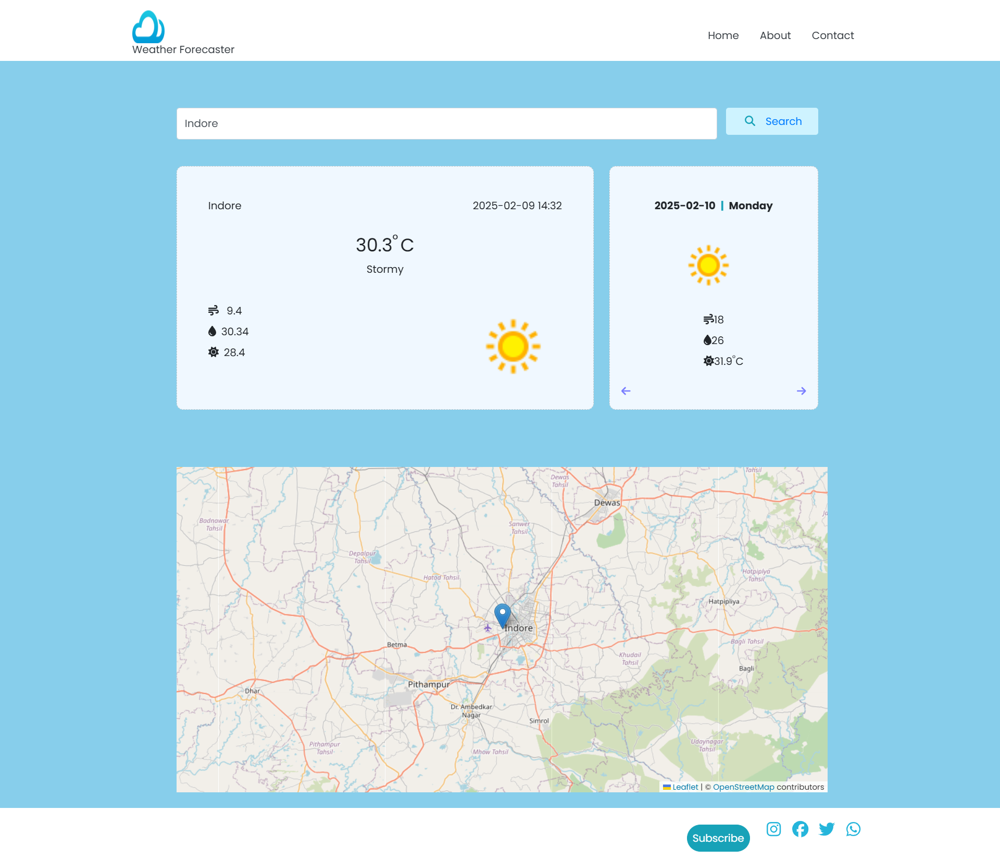

# Weather Forecaster

This application provides real-time weather updates and a three-day forecast based on your current location. By accessing your device's geolocation and utilizing Google Maps for accurate coordinates, it fetches weather data from the OpenWeatherMap API. Key features include:

- Current temperature
- Humidity levels
- Cloud and rainfall status

With a simple and intuitive interface, this app ensures you stay updated on weather conditions anytime, anywhere.

## Tech Stack

- ReactJS `v17`
- Typescript
- HTML5, Bootstrap
- Axios

## Installation

```bash
  git clone https://github.com/sakshikhargone/Weather-Forecaster.git
```

```bash
  cd Weather-Forecaster
```

```bash
  npm install
```

```bash
  npm run start
```

## App Screenshot- 🌦️



## Support

For tech support, email sakshi.khargone@gmail.com
